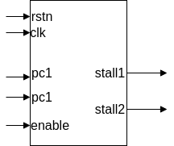
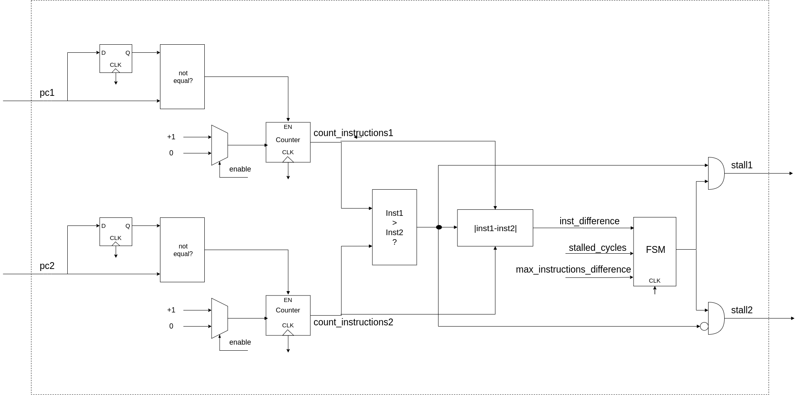

# DeRISC


### Introduction 

In this document it is described the light-lockstep module. Below, in the figure  it is shown the scheme of the comparator and its signals. Signals situated on the left are the inputs whereas signals situated on the right are the outputs. 



The objective of this module is to ensure that neither core is more than a set number of instructions ahead of the other.

### Configuration

As you can see below, some parameters can be configured within the design through generics: 

```  generic(
    stalled_cycles              : natural := 1000;
    max_instructions_difference : natural := 1000;  
    PC_RST                      : integer := 0      -- PC value at reset
    );  
```

Generic 'stalled\_cycles' indicate the number of cycles that the core with more executed instructions is stalled. Generic 'max\_instructions\_difference' indicates the number of instructions that one core has to be ahead of the other to get stalled. 


### Block diagram 


Below in the figure \ref{fig:block_diagram}, you can see a simple block diagram of the design.




### AMBA bus

\section{AMBA bus connection}

To enable or disable the module during runtime, a complementary APB module is added. This module is an APB slave that will define an APB I/O bank. Wihtin this module there is a one-bit register that will be modified each time that a writing is performed to one of the memory directions of the I/O bank. 

When the value of the register is '1', the output 'enable' (input for the comparator module) is '1' and the comparator is enabled. When this value is '0', the comparator is disabled. 

When writing the register, each value different from 0 will set this register to '1' and only the value 0 will set the register to '0'. This, register can be also read.

Below you can see the entity definition of the APB module.


```entity apb_example is
    generic (
        pindex : integer := 0;
        paddr  : integer := 0;
        pmask  : integer := 16#fff#);
    port (
        rst    : in  std_ulogic;
        clk    : in  std_ulogic;
        apbi   : in  apb_slv_in_type;
        apbo   : out apb_slv_out_type;
        enable : out std_logic)
    end;
```


The generic 'paddr' defines the start address of the bank. The 'pmask' generic sets the size of the bank. For our purpose, the size of the memory should be as small as possible. This is achieved setting pmask to its maximum possible value (0xFFF). This minimum size is 256 bytes.


### Testbench 

To verify that the module behaves as expected, a testbench was designed. This testbench simulates both PC inputs and creates random stalls for each PC. The testbench also checks that neither of the cores is "max\_instructions\_difference" ahead of the other during the simulation time.


